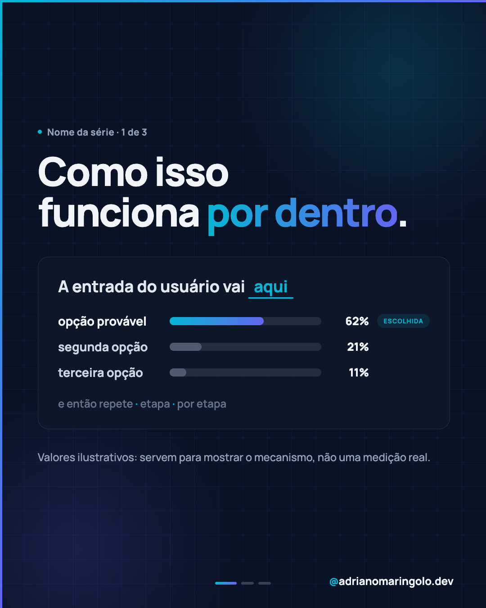

# Templates de post — Instagram @adrianomaringolo.dev

> Este arquivo é o **índice de templates** do projeto. A skill `instagram-post` procura por ele.
> Ao encontrá-lo, a skill **pergunta qual template seguir** antes de desenhar qualquer slide.

Um template define o **esqueleto visual** de um post: como é a capa, como são os slides
internos, como o fecho funciona, que papel a imagem tem e qual a escala tipográfica.
Ele **não** define o conteúdo nem congela o layout: cada template tem uma seção
`Variações permitidas` (o que pode mudar de post pra post) e uma seção `Travas`
(o que nunca muda, sob pena de o feed perder unidade).

Tudo que é comum a **todos** os templates — paleta, fonte, accent borders, progress dots,
handle, regras de export — está em [`../design-system.md`](../design-system.md) e em
[`../BRAND.md`](../BRAND.md). Os arquivos aqui só descrevem o que **diferencia** cada template.

---

## Catálogo

| ID | Nome | Quando usar | Formato | Imagem obrigatória? |
|---|---|---|---|---|
| `foto-editorial` | [Foto editorial](foto-editorial.md) | Tema com rosto, ambiente ou objeto real. Conteúdo educativo/opinativo que ganha com foto. | Carrossel 5–9 | **Sim** — foto de capa |
| `tipografico` | [Tipográfico](tipografico.md) | Conceito, lista, comparativo, número. Quando não existe foto boa e a ideia se sustenta no texto. | Carrossel 5–9 | Não — ilustração SVG opcional |
| `case-showcase` | [Case / showcase](case-showcase.md) | Apresentar um projeto entregue, produto ou biblioteca. Prova de trabalho. | Carrossel 6–8 | **Sim** — screenshots do projeto |
| `dado-visual` | [Dado visual](dado-visual.md) | Uma estatística, pesquisa ou número forte é o protagonista. | Único ou carrossel 3–7 | Não — gráfico em CSS/SVG |
| `explicador-tecnico` | [Explicador técnico](explicador-tecnico.md) | Explicar um mecanismo (como a IA funciona, como um sistema decide). Precisa de diagrama ou interface simulada. | Carrossel 6–9 ou único | Não — diagrama/UI em HTML |
| `frase-unica` | [Frase única](frase-unica.md) | Uma ideia forte, provocação ou princípio. Ritmo e reforço de posicionamento. | Único (1 slide) | Opcional — foto de fundo |
| `foto-protagonista` | [Foto protagonista](foto-protagonista.md) | A imagem é o conteúdo. Bastidor, retrato, projeto no mundo real. Só um título no topo. | Único ou carrossel 3–7 | **Sim** — foto própria |

---

---

## Galeria

Cada template tem imagens de exemplo com conteúdo placeholder em
[`previews/`](previews/). Elas mostram o esqueleto — não são posts reais.

<table>
<tr>
<td width="32%"></td>
<td width="32%"></td>
<td width="32%"></td>
</tr>
<tr>
<td align="center"><b><code>foto-editorial</code></b></td>
<td align="center"><b><code>tipografico</code></b></td>
<td align="center"><b><code>case-showcase</code></b></td>
</tr>
<tr>
<td width="32%"></td>
<td width="32%"></td>
<td width="32%"></td>
</tr>
<tr>
<td align="center"><b><code>dado-visual</code></b></td>
<td align="center"><b><code>explicador-tecnico</code></b></td>
<td align="center"><b><code>frase-unica</code></b></td>
</tr>
<tr>
<td width="32%"></td>
<td width="32%"></td>
<td width="32%"></td>
</tr>
<tr>
<td align="center"><b><code>foto-protagonista</code></b></td>
<td></td>
<td></td>
</tr>
</table>

Cada `.md` de template abre com o conjunto completo (capa, interno e fecho).

### Regerar as imagens

```bash
node instagram-posts/scripts/export-templates.mjs                 # todos
node instagram-posts/scripts/export-templates.mjs tipografico     # só um
node instagram-posts/scripts/export-templates.mjs --scale 0.5     # arquivos mais leves
```

O script lê `templates/previews/<id>/*.html` e grava o `.png` ao lado. Ao mexer no
esqueleto de um template, ajuste o HTML do preview junto e rode o export — a imagem é
a documentação visual do template.

## Como a skill usa este arquivo

1. Detecta `instagram-posts/templates/TEMPLATES.md`.
2. Lê a tabela acima e **pergunta ao usuário qual template usar**, sugerindo o mais provável
   com base no tema pedido (ver "Sugestão automática" abaixo).
3. Lê o `.md` do template escolhido **por inteiro** antes de escrever HTML — inclusive a
   seção `Preview`, que mostra o esqueleto renderizado.
4. Aplica: `design-system.md` (base) + template escolhido (esqueleto) + pedido do usuário (conteúdo).
5. Registra o template usado em `meta.json`, no campo `"template"`.

### Sugestão automática (a skill sugere, o usuário confirma)

| Sinal no pedido | Template sugerido |
|---|---|
| "case", "projeto", "site que fiz", nome de cliente | `case-showcase` |
| "%", "pesquisa", "estudo", "X em cada Y", número no tema | `dado-visual` |
| "como funciona", "por dentro", "explicando", IA/arquitetura | `explicador-tecnico` |
| "post único", "frase", "provocação", "princípio" | `frase-unica` |
| "foto", "bastidor", "rotina", "retrato", "ensaio", nome de lugar ou evento | `foto-protagonista` |
| Tema pessoal que precisa ser desenvolvido em vários slides | `foto-editorial` |
| Lista, comparativo, "N razões", "quanto custa", conceito abstrato | `tipografico` |

Se o pedido não der sinal claro, a skill pergunta sem sugerir favorito.

---

## Criar e refinar templates

A skill tem dois comandos para isso — prefira eles a editar na mão, porque eles mantêm
`.md`, previews e índice em sincronia:

```
/instagram-post criar-template [ideia]
/instagram-post refinar-template [id] [o que mudar]
```

**`criar-template`** levanta o que dá do repo, checa se a ideia não é só uma variação de um
template existente, entrevista em duas rodadas (identidade e esqueleto · regras e limites),
escreve o `.md`, cria e exporta os previews e registra no catálogo, na galeria e na tabela
de sinais.

**`refinar-template`** lê o `.md`, os previews e os posts que usam o template, devolve um
retrato de como ele está hoje (esqueleto, variações, travas, onde os posts já derivaram),
pergunta o que adaptar, analisa o impacto em posts existentes antes de apertar qualquer
regra e aplica nos três lugares.

Nenhum dos dois altera posts já feitos: template é regra daqui pra frente.

### Na mão, se preferir

1. Copie a estrutura de um `.md` existente (todos seguem a mesma ordem de seções).
2. Crie `previews/<id>/slide-01.html` (e os demais) com conteúdo placeholder e rode
   `node instagram-posts/scripts/export-templates.mjs <id>`.
3. Adicione a linha no catálogo e o card na galeria acima.
4. Se ele tiver um gancho de sugestão automática, adicione na tabela de sinais.

Seções obrigatórias em todo template: `Preview` · `Quando usar` · `Estrutura de slides` ·
`Capa` · `Slides internos` · `Fecho` · `Imagens` · `Escala tipográfica` ·
`Variações permitidas` · `Travas` · `Posts de referência`.
