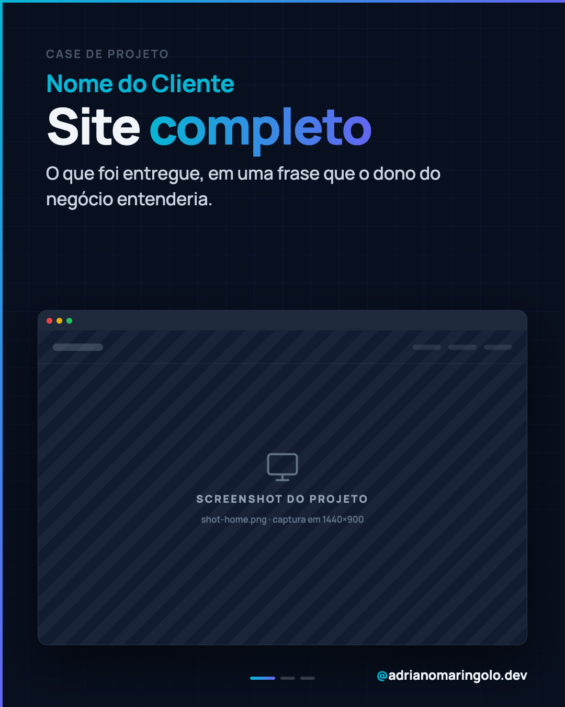
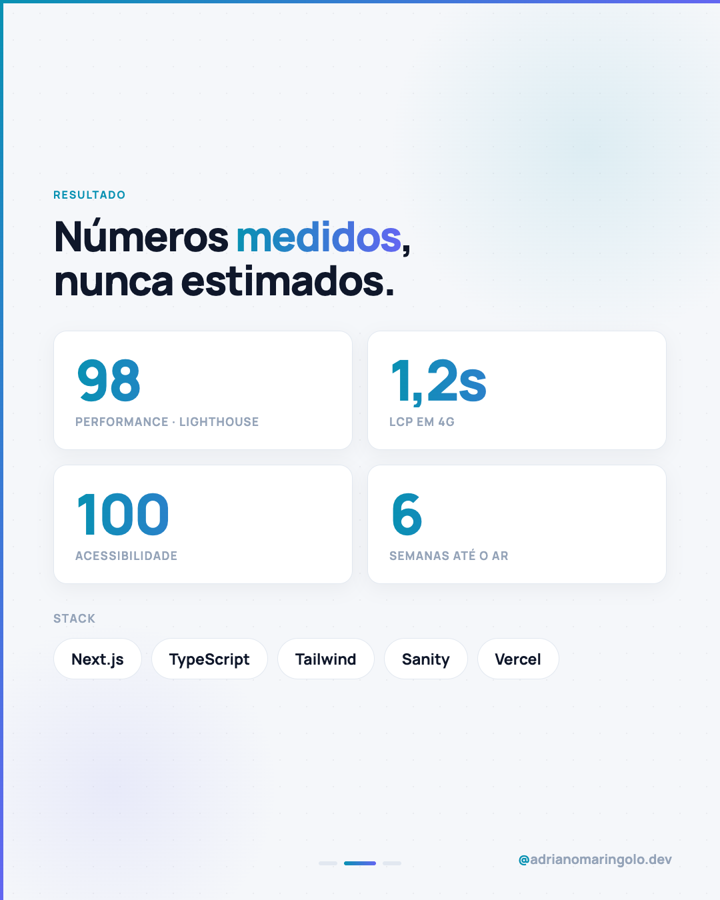

# Template `case-showcase`

Vitrine de projeto entregue. Fundo escuro com grid técnico, screenshot real do projeto
dentro de um mockup de browser. É o template de **prova de trabalho** (pilar 2).

---

## Preview

<table>
<tr><td width="32%"></td><td width="32%"></td><td width="32%"></td></tr>
<tr><td align="center"><b>Capa</b><br><sub>grid + mockup de browser</sub></td><td align="center"><b>Interno</b><br><sub>métricas + stack</sub></td><td align="center"><b>Fecho</b><br><sub>CTA de conversão</sub></td></tr>
</table>

Conteúdo placeholder. O HTML que gera estas imagens está em `previews/case-showcase/` — edite e rode
`node scripts/export-templates.mjs case-showcase` para regerar.

---

## Quando usar

- Apresentar um site, app ou biblioteca que você entregou.
- Mostrar antes/depois, decisões de UX, métricas de performance.
- Lançamento de case de cliente.

---

## Estrutura de slides

| Slide | Papel | Tema |
|---|---|---|
| 01 | Capa: nome do projeto + mockup do browser | Escuro `#080f1e` |
| 02 | O desafio / contexto do cliente | Claro `#f5f7fa` |
| 03 | O que foi construído (features) | Claro |
| 04 a N-2 | Destaques: telas, decisões, números (Lighthouse, LCP) | Claro ou escuro alternando |
| N-1 | Stack / tecnologias | Claro |
| N | CTA "seu projeto pode ser o próximo" | Escuro `#0f172a` |

Faixa: **6 a 8 slides**.

---

## Capa

Fundo escuro com grid de linhas indigo + vinheta radial. Texto no topo, mockup de browser
ancorado na base.

```css
body { width: 1080px; height: 1350px; overflow: hidden;
       background: #080f1e; font-family: 'Manrope', sans-serif; }

.bg-grid { position: absolute; inset: 0; background-color: #080f1e;
  background-image:
    linear-gradient(rgba(99,102,241,0.09) 1px, transparent 1px),
    linear-gradient(90deg, rgba(99,102,241,0.09) 1px, transparent 1px);
  background-size: 54px 54px; }

.bg-vignette { position: absolute; inset: 0;
  background: radial-gradient(ellipse 80% 60% at 50% 30%, transparent 40%, rgba(8,15,30,0.6) 100%); }
```

### Mockup de browser

```html
<div class="preview-wrap">
  <div class="preview-glow"></div>
  <div class="preview-frame">
    <div class="preview-topbar">
      <span class="dot-r"></span><span class="dot-y"></span><span class="dot-g"></span>
    </div>
    
  </div>
</div>
```

```css
.preview-wrap  { position: absolute; bottom: 108px; left: 72px; right: 72px; z-index: 15; }
.preview-glow  { position: absolute; inset: -24px; border-radius: 28px;
  background: radial-gradient(ellipse at center, rgba(6,182,212,0.22), transparent 70%);
  filter: blur(28px); }
.preview-frame { position: relative; border-radius: 18px; overflow: hidden;
  border: 1.5px solid rgba(148,163,184,0.22);
  box-shadow: 0 32px 80px rgba(0,0,0,0.55); background: #0f172a; }
.preview-topbar{ height: 38px; display: flex; align-items: center; gap: 8px;
  padding: 0 16px; background: #1e293b; }
.preview-topbar span { width: 11px; height: 11px; border-radius: 50%; }
.dot-r { background: #ef4444; } .dot-y { background: #eab308; } .dot-g { background: #22c55e; }
.preview-img   { display: block; width: 100%; }
```

Headline usa a mesma estrutura de `foto-editorial`: `eyebrow` → `headline-kicker`
(nome do cliente) → `headline` com `headline-gradient` → `subtitle`.

---

## Slides internos

Base clara padrão. Componentes que funcionam melhor aqui:

- **Grid de features**: dois ou três `card` lado a lado com ícone Lucide no topo.
- **Números de performance**: valor gigante (72–96px, weight 900, gradiente) + rótulo
  pequeno abaixo. Ex.: `98` / `PERFORMANCE — LIGHTHOUSE`.
- **Screenshot em contexto**: mockup de browser ou de celular, menor que o da capa,
  com legenda curta.
- **Stack**: chips arredondados com o nome de cada tecnologia (`Next.js`, `Tailwind`,
  `Sanity`), borda `#e2e8f0`, fundo `#fff`.

---

## Fecho

CTA escuro `#0f172a`. Texto voltado para conversão: quem lê é um dono de negócio que
acabou de ver a prova. `cta-box` com `adrianomaringolo.dev`.

---

## Imagens

- Screenshots reais do projeto, na pasta do post: `shot-home.png`, `shot-mobile.png`, etc.
- Capture em **viewport desktop 1440×900** (ou 390×844 para mobile) e não redimensione
  para baixo antes de inserir — deixe o CSS reduzir.
- Nunca use mockup genérico de stock no lugar do screenshot real.
- Se o cliente não autorizou divulgação, não publique o case.
- Screenshot deve mostrar a tela em estado real: conteúdo preenchido, sem loading, sem
  placeholder "lorem ipsum".

---

## Escala tipográfica

| Elemento | Tamanho | Peso | Cor |
|---|---|---|---|
| `eyebrow` | 22px | 700 | `#475569`, uppercase |
| `headline-kicker` (cliente) | 48px | 700 | `#06b6d4` |
| `headline` | 96–102px | 900 | `#f1f5f9` |
| `subtitle` | 34–36px | 500 | `#cbd5e1` |
| Número de métrica | 72–96px | 900 | gradiente cyan→indigo |
| Chip de stack | 22–24px | 700 | `#0f172a` |

---

## Variações permitidas

- Mockup de browser (padrão) ou de celular, conforme o projeto.
- Grid da capa pode virar pontos (`bg-dots`) quando o screenshot já tem muitas linhas.
- Slides de destaque podem ser escuros para criar ritmo, desde que alternem com claros.
- Quantidade de screenshots livre: 1 na capa + 1 a 3 nos internos.
- Slide de stack pode ser omitido em projetos pequenos.
- Métricas entram só se existirem de verdade — não invente Lighthouse.

## Travas

- Capa **sempre** escura com screenshot real do projeto.
- Nada de número inventado: métrica sem fonte não entra.
- Nome do cliente aparece no `headline-kicker`, não no meio do headline.
- Fecho **sempre** escuro com CTA.
- `accent-left` + `accent-top`, progress dots e handle em todos os slides.
- `background` escuro declarado no `body`.

---

## Posts de referência

`post-06` (GoLaser Barão Geraldo) · `post-07` (BuildGrid UI) ·
`post-16` (Yane Leitão Personal Chef).
