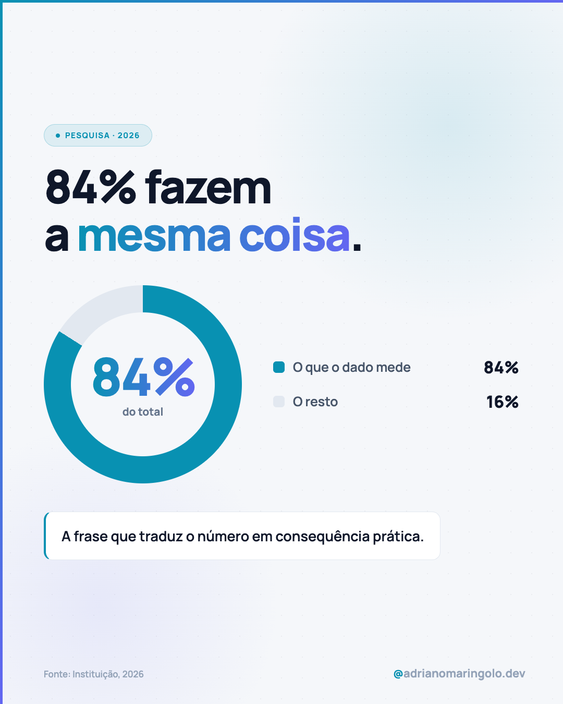
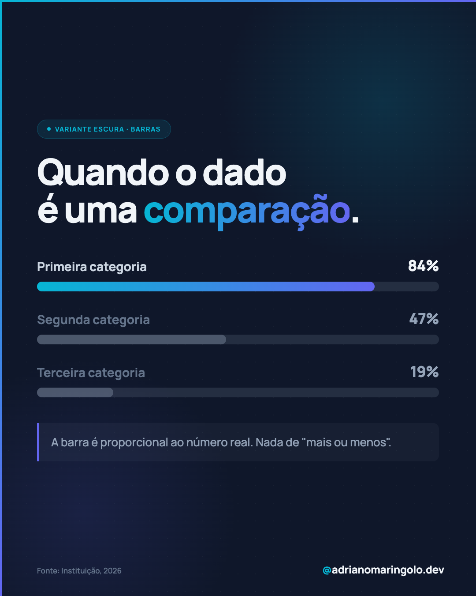

# Template `dado-visual`

Um número é o protagonista. O slide inteiro se organiza em volta de uma estatística, com
gráfico feito em CSS/SVG e **fonte citada**. Funciona como post único (o mais comum) ou
como carrossel curto que desdobra o dado.

---

## Preview

<table>
<tr><td width="49%"></td><td width="49%"></td></tr>
<tr><td align="center"><b>Donut, tema claro</b><br><sub>post único</sub></td><td align="center"><b>Barras, tema escuro</b><br><sub>comparação</sub></td></tr>
</table>

Conteúdo placeholder. O HTML que gera estas imagens está em `previews/dado-visual/` — edite e rode
`node scripts/export-templates.mjs dado-visual` para regerar.

---

## Quando usar

- Existe uma pesquisa, benchmark ou estatística que sustenta um argumento.
- O número é surpreendente o bastante para parar o scroll sozinho.
- Pilares 1 e 4.

**Pré-requisito inegociável:** a fonte existe, é verificável e vai no slide. Sem fonte,
não use este template.

---

## Estrutura de slides

### Post único (padrão)
Um slide com: rótulo → headline curta → gráfico → legenda → nota → fonte → handle.
**Sem** progress dots (não é carrossel).

### Carrossel curto (3–7 slides)
| Slide | Papel | Tema |
|---|---|---|
| 01 | O número (mesma composição do post único) | Claro ou escuro |
| 02 | O que o número quer dizer | Claro |
| 03 a N-1 | Desdobramento / contra-argumento | Claro |
| N | CTA | Escuro |

---

## Capa / slide do dado

```html
<div class="slide">
  <div class="blob-1"></div><div class="blob-2"></div><div class="bg-dots"></div>
  <div class="accent-left"></div><div class="accent-top"></div>

  <div class="content">
    <div class="label">
      <div class="label-dot"></div>
      <span class="label-text">Pesquisa 2025</span>
    </div>

    <h1 class="headline">84% dos devs<br>já usam <em>IA</em></h1>

    <div class="chart"><!-- donut, barras ou pictograma --></div>

    <div class="legend">
      <div class="legend-row">
        <span class="legend-chip"></span>
        <span class="legend-label">Usam no dia a dia</span>
        <span class="legend-value">84%</span>
      </div>
    </div>

    <div class="footnote"><p class="footnote-text">O que isso muda na prática.</p></div>
    <div class="source">Fonte: Stack Overflow Developer Survey 2025</div>
  </div>

  <div class="handle"><em>@</em>adrianomaringolo.dev</div>
</div>
```

### Formas de gráfico

**Donut em CSS** (duas fatias, `conic-gradient`):
```css
.chart { position: relative; width: 420px; height: 420px; border-radius: 50%;
  background: conic-gradient(#0891b2 0 84%, #e2e8f0 84% 100%); }
.chart-center { position: absolute; inset: 56px; border-radius: 50%; background: #f5f7fa;
  display: flex; flex-direction: column; align-items: center; justify-content: center; }
.chart-value { font-size: 104px; font-weight: 900; letter-spacing: -0.04em;
  background: linear-gradient(90deg, #0891b2, #6366f1);
  -webkit-background-clip: text; -webkit-text-fill-color: transparent; background-clip: text; }
.chart-caption { font-size: 22px; font-weight: 700; color: #64748b; }
```

**Barras horizontais** (comparação entre itens):
```css
.track { height: 22px; border-radius: 11px; background: #e2e8f0; overflow: hidden; }
.fill  { height: 100%; border-radius: 11px;
         background: linear-gradient(90deg, #0891b2, #6366f1); }
```

**Pictograma** (10 ícones, N preenchidos) — melhor que porcentagem quando o número é
"X em cada 10". Ícones Lucide, preenchidos em `#0891b2`, vazios em `#cbd5e1`.

### Rótulo em pílula

```css
.label { display: inline-flex; align-items: center; gap: 10px; width: fit-content;
  background: rgba(6,182,212,0.10); border: 1.5px solid rgba(6,182,212,0.25);
  border-radius: 100px; padding: 10px 22px; }
.label-dot  { width: 8px; height: 8px; background: #06b6d4; border-radius: 50%; }
.label-text { font-size: 15px; font-weight: 700; color: #06b6d4;
              letter-spacing: 0.1em; text-transform: uppercase; }
```

### Fonte (obrigatória)

```css
.source { position: absolute; bottom: 44px; left: 72px;
  font-size: 17px; font-weight: 600; color: #94a3b8; }
```

Formato: `Fonte: <instituição>, <ano>`. Se o dado veio de um artigo, cite a instituição
original, não o blog que reproduziu.

---

## Slides internos (só no modo carrossel)

Base clara padrão. O dado da capa vira argumento: cada slide interno responde "e daí?".
Use `highlight` para o takeaway e `note` para a ressalva honesta.

---

## Fecho

No post único não há fecho — o CTA vive na legenda.
No carrossel, CTA escuro padrão `#0f172a`.

---

## Imagens

Nenhuma foto. O gráfico é o elemento visual e é construído em CSS/SVG.

Se o dado precisar de contexto humano, prefira `foto-editorial` com o número no headline.

---

## Escala tipográfica

| Elemento | Tamanho | Peso | Cor |
|---|---|---|---|
| `label-text` | 15px | 700 | `#06b6d4`, uppercase |
| `headline` | 76–92px | 900 | `#0f172a` (claro) ou `#f1f5f9` (escuro) |
| `chart-value` | 96–110px | 900 | gradiente cyan→indigo |
| `legend-label` | 24–26px | 600 | `#475569` |
| `legend-value` | 30–34px | 800 | `#0f172a` |
| `footnote-text` | 26–28px | 500 | `#475569` |
| `source` | 16–18px | 600 | `#94a3b8` |

---

## Variações permitidas

- Tema claro (padrão) ou escuro, conforme o post vizinho no feed.
- Donut, barras ou pictograma — escolha o que representa melhor o dado.
- Post único (padrão) ou carrossel curto.
- Legenda de chart com 1 a 4 linhas.
- `footnote` opcional quando o número já se explica.
- Headline pode ou não conter o número; se contiver, o gráfico pode ser menor.

## Travas

- **Fonte sempre visível no slide.** Sem exceção.
- Um dado por slide. Dois números competindo = nenhum é lembrado.
- Gráfico proporcional ao dado real: 84% ocupa 84% do donut, não "mais ou menos".
- Paleta só cyan/indigo + cinzas. Nada de vermelho/verde de dashboard.
- Post único **não** leva progress dots.
- `accent-left` + `accent-top` e handle sempre.

---

## Posts de referência

`post-08` (84% dos devs já usam IA) · `post-11` (ser educado com o ChatGPT custa milhões).
