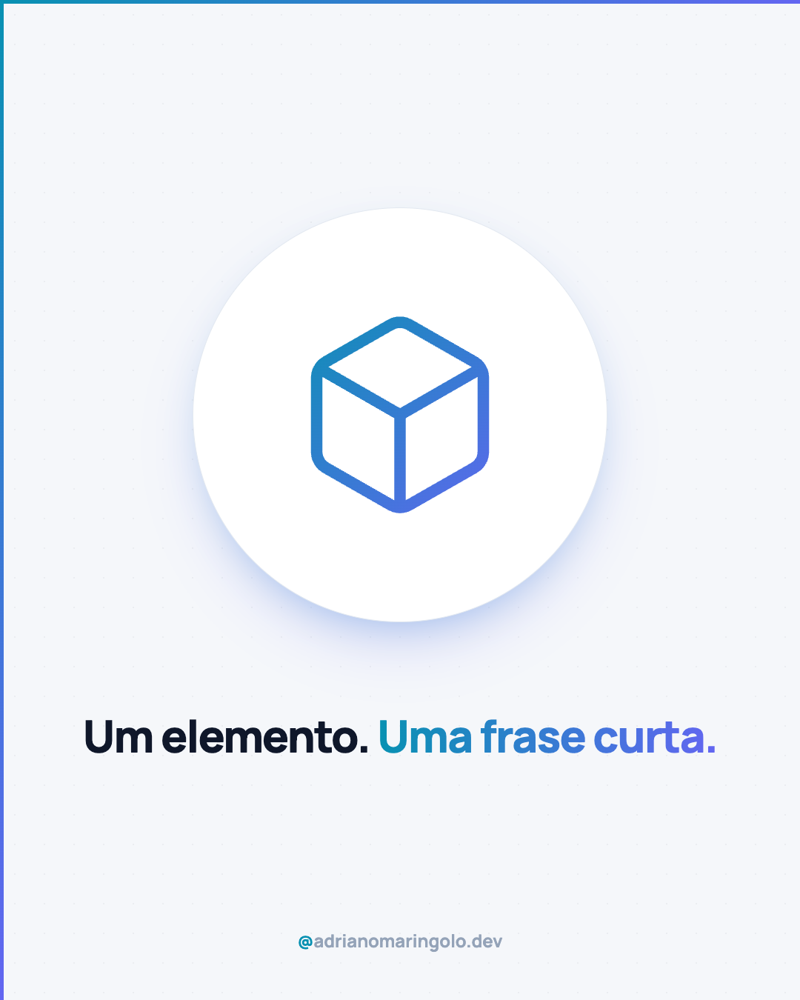
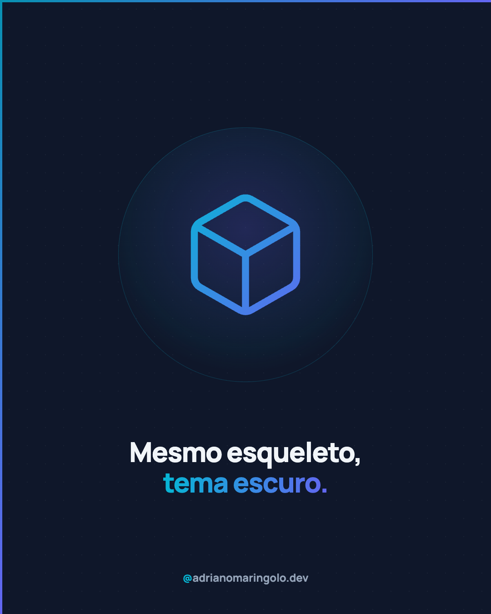
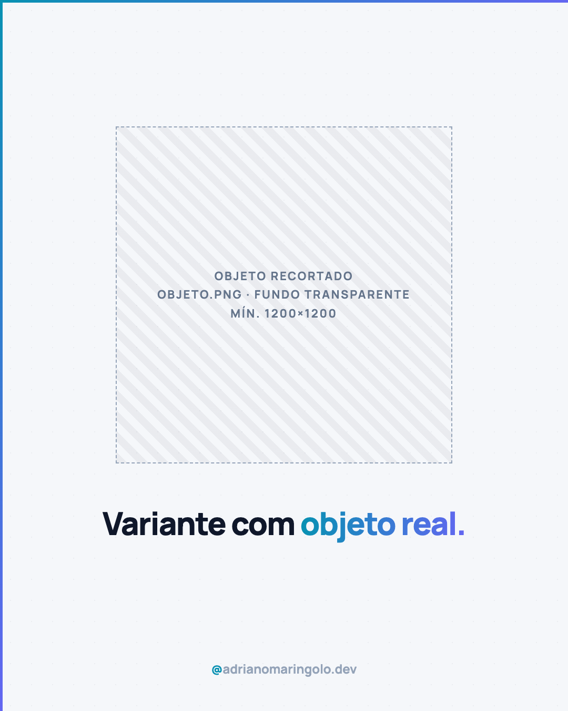

# Template `elemento-central`

Um slide. Um elemento no centro, uma frase curta embaixo. É o post de menos conteúdo do
feed: a imagem segura o olhar, a frase entrega a ideia em 2 segundos, o resto mora na legenda.

---

## Preview

<table>
<tr><td width="32%"></td><td width="32%"></td><td width="32%"></td></tr>
<tr><td align="center"><b>Variante A</b><br><sub>ícone, tema claro</sub></td><td align="center"><b>Variante B</b><br><sub>ícone, tema escuro</sub></td><td align="center"><b>Variante C</b><br><sub>objeto recortado</sub></td></tr>
</table>

Conteúdo placeholder. O HTML que gera estas imagens está em `previews/elemento-central/` — edite e rode
`node scripts/export-templates.mjs elemento-central` para regerar.

---

## Quando usar

- A ideia tem um **símbolo óbvio**: cadeado (segurança), chave (domínio), lupa (Google),
  ampulheta (velocidade), casa (site próprio).
- Semana cheia: é o post mais rápido de produzir do projeto.
- Ritmo de feed: respiro visual entre carrosséis densos.
- Pilar 1 (educação em dose curta) e pilar 5 (opinião).

**Não use quando** a frase é o protagonista e não existe um objeto que a represente: aí é
`frase-unica`. A diferença numa frase: no `frase-unica` o texto ocupa o slide e o ícone é
opcional; no `elemento-central` o **elemento ocupa o slide** e o texto é legenda dele.
Se a frase passa de 10 palavras, também é `frase-unica`.

---

## Estrutura de slides

**Um slide só.** `"type": "single"` no `meta.json`, formato `1080x1350`.

Sem progress dots, sem eyebrow, sem subtítulo. Três camadas e nada mais:

1. **Elemento** no palco, centro óptico (um pouco acima do meio, `top: 560px`).
2. **Frase** centralizada abaixo (`top: ~960px`).
3. **Handle** centralizado no rodapé.

---

## Capa (o slide)

### Variante A — ícone, tema claro (padrão)

Palco circular branco com sombra colorida (cyan + indigo, nunca cinza), ícone Lucide grande
com stroke em gradiente.

```html
<div class="stage light">
  <svg width="300" height="300" viewBox="0 0 24 24" fill="none" stroke="url(#g)"
       stroke-width="1.25" stroke-linecap="round" stroke-linejoin="round">
    <defs><linearGradient id="g" x1="0" y1="0" x2="24" y2="24" gradientUnits="userSpaceOnUse">
      <stop offset="0" stop-color="#0891b2"/><stop offset="1" stop-color="#6366f1"/>
    </linearGradient></defs>
    <!-- path(s) do ícone Lucide, copiados sem alteração -->
  </svg>
</div>
<p class="phrase">Site lento não ganha <em>segunda chance</em>.</p>
<div class="handle"><em>@</em>adrianomaringolo.dev</div>
```

```css
.stage { position: absolute; left: 50%; top: 560px; transform: translate(-50%, -50%);
  width: 560px; height: 560px; border-radius: 50%; z-index: 10;
  display: flex; align-items: center; justify-content: center; }
.stage.light { background: #ffffff; border: 1px solid #e2e8f0;
  box-shadow: 0 40px 90px -30px rgba(99,102,241,0.35), 0 20px 50px -20px rgba(8,145,178,0.25); }

.phrase { position: absolute; left: 110px; right: 110px; top: 960px; z-index: 10;
  text-align: center; font-size: 60px; font-weight: 800; line-height: 1.12;
  letter-spacing: -0.03em; text-wrap: balance; color: #0f172a; }
.phrase em { font-style: normal; background: linear-gradient(90deg, #0891b2, #6366f1);
  -webkit-background-clip: text; -webkit-text-fill-color: transparent; background-clip: text; }

.handle { position: absolute; bottom: 64px; left: 0; right: 0; text-align: center; }
```

Fundo: só `.bg-dots` sutil. **Sem blobs** — o palco já é o foco de cor.

### Variante B — ícone, tema escuro

Fundo `#0f172a` (declarado no `body`), palco vira um halo radial indigo com borda cyan
translúcida, gradiente do ícone começa em `#06b6d4`.

```css
body, .slide { background: #0f172a; }
.stage.dark { background: radial-gradient(circle at 50% 40%, rgba(99,102,241,0.22),
  rgba(8,145,178,0.06) 60%, transparent 72%); border: 1px solid rgba(6,182,212,0.22); }
.phrase { color: #f1f5f9; }
```

### Variante C — objeto recortado

Em vez do ícone, um objeto real (foto) com **fundo transparente**, sem palco circular:
a sombra do próprio objeto faz o papel de palco.

```css
.object { position: absolute; left: 50%; top: 560px; transform: translate(-50%, -50%);
  width: 640px; height: 640px; object-fit: contain; z-index: 10;
  filter: drop-shadow(0 40px 50px rgba(99,102,241,0.28)); }
```

---

## Slides internos

Não existem. Se a ideia precisa de mais de um slide, use `tipografico`.

---

## Fecho

Não existe slide de CTA. O handle centralizado no rodapé faz o papel de assinatura, e o
CTA vive na legenda.

---

## Imagens

- Variantes A e B: **nenhuma** — o elemento é um ícone Lucide, path copiado da biblioteca
  (`lucide-react` já está no `node_modules` do monorepo, ou lucide.dev → Copy SVG).
- Variante C: `objeto.png` na pasta do post, **fundo transparente**, mínimo 1200×1200,
  objeto centralizado com margem. Um objeto só, sem cenário. Foto de banco com fundo
  não recortado não serve.

---

## Escala tipográfica

| Elemento | Tamanho | Peso | Cor |
|---|---|---|---|
| `phrase` | 52–64px | 800 | `#0f172a` (claro) / `#f1f5f9` (escuro); `<em>` em gradiente |
| `handle` | 22–24px | 700 | `#94a3b8`, `@` em cyan |

A frase é **deliberadamente menor** que o headline do `frase-unica` (96–116px): aqui quem
grita é o elemento.

---

## Variações permitidas

- Tema claro ou escuro; ícone ou objeto recortado.
- Forma do palco: círculo (padrão) ou quadrado arredondado (`border-radius: 120px`).
- Tamanho do ícone de 260px a 340px, conforme a densidade do desenho (ícone com muito
  detalhe fica menor).
- Frase em uma ou duas linhas, de 52px a 64px.
- Trecho em gradiente (`<em>`) no início, meio ou fim da frase, ou nenhum.
- Um segundo ícone pequeno (≤ 96px) orbitando o palco, quando a ideia é uma relação
  (ex.: chave + cadeado). Nunca mais de um.

## Travas

- **Um slide**, `"type": "single"`, sem progress dots. É um post único, ponto.
- **Um elemento principal.** Dois objetos disputando o centro viram diagrama: é outro template.
- **Frase com no máximo 10 palavras**, sem eyebrow e sem subtítulo. Se precisa explicar,
  a explicação vai para a legenda. Menos conteúdo é o propósito do template.
- **Ícone sempre da Lucide**, path copiado sem edição, `stroke-width` entre 1 e 1.5.
  Ícone improvisado é o que mais denuncia post amador num formato em que ele está sozinho.
- Handle sempre presente; `accent-left` + `accent-top` sempre.
- Sem emoji no slide. Slide escuro: `background` declarado no `body`.

---

## Posts de referência

Nenhum ainda. O primeiro post deste template vira a referência.
