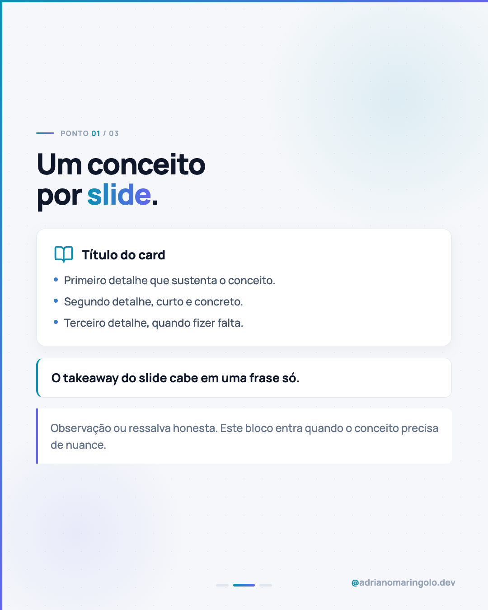

# Template `foto-editorial`

Capa escura com **foto real de fundo** sob um overlay gradiente, slides internos claros,
fecho escuro. É o template mais "revista": a foto dá contexto humano e o texto vive na
faixa escura do topo.

---

## Preview

<table>
<tr><td width="32%"></td><td width="32%"></td><td width="32%"></td></tr>
<tr><td align="center"><b>Capa</b><br><sub>foto + overlay, texto no topo</sub></td><td align="center"><b>Interno</b><br><sub>card + highlight + note</sub></td><td align="center"><b>Fecho</b><br><sub>CTA escuro</sub></td></tr>
</table>

Conteúdo placeholder. O HTML que gera estas imagens está em `previews/foto-editorial/` — edite e rode
`node scripts/export-templates.mjs foto-editorial` para regerar.

---

## Quando usar

- O tema tem um sujeito fotografável: uma pessoa, um ambiente de trabalho, um objeto.
- Conteúdo educativo ou opinativo que ganha com presença humana (pilares 1, 2 e 5).
- Posts pessoais/bastidor onde aparecer o rosto aumenta conexão.

**Não use** quando a única foto disponível for banco de imagem genérico sem relação com o
tema — nesse caso `tipografico` entrega mais.

---

## Estrutura de slides

| Slide | Papel | Tema |
|---|---|---|
| 01 | Capa com foto + headline | Escuro `#0a1226` |
| 02 | Contexto / problema | Claro `#f5f7fa` |
| 03 a N-1 | Desenvolvimento — um conceito por slide | Claro |
| N | CTA com URL | Escuro `#0f172a` |

Faixa: **5 a 9 slides**. Abaixo de 5 a ideia fica rasa; acima de 9 o carrossel perde retenção.

---

## Capa

Foto cobrindo o slide inteiro, overlay gradiente vertical do topo (opaco) para a base
(semi-transparente). Texto **sempre na metade superior**, sobre a área opaca.

```html
<div class="slide">
  <div class="bg-photo"></div>
  <div class="gradient-overlay"></div>
  <div class="accent-left"></div>
  <div class="accent-top"></div>

  <div class="content">
    <div class="eyebrow">CATEGORIA DO POST</div>
    <h1 class="headline">
      <span class="headline-kicker">kicker opcional</span>
      Headline <span class="headline-gradient">principal</span>
    </h1>
    <p class="subtitle">Frase de apoio que completa o headline.</p>
  </div>

  <div class="progress"><!-- dots --></div>
  <div class="handle"><em>@</em>adrianomaringolo.dev</div>
</div>
```

```css
body { width: 1080px; height: 1350px; overflow: hidden;
       background: #0a1226; font-family: 'Manrope', sans-serif; }

.bg-photo { position: absolute; inset: 0;
  background: url('bg-cover.jpg') center center / cover no-repeat; }

.gradient-overlay { position: absolute; inset: 0;
  background: linear-gradient(to bottom,
    rgba(10,18,38,1.00)  0%,
    rgba(10,18,38,0.97) 22%,
    rgba(10,18,38,0.90) 38%,
    rgba(10,18,38,0.78) 52%,
    rgba(10,18,38,0.65) 66%,
    rgba(10,18,38,0.55) 80%,
    rgba(10,18,38,0.50) 100%); }

.content { position: absolute; top: 0; left: 0; right: 0; z-index: 10;
  padding: 88px 80px 0 88px; display: flex; flex-direction: column; gap: 20px; }
```

### Bloco "quem fala" (opcional, posts pessoais)

Quando o post é em primeira pessoa, a capa pode trazer o avatar no rodapé — ver `post-19`:

```html
<div class="bottom">
  <div class="who">
    <div class="avatar-ring"><div class="avatar"></div></div>
    <div class="who-body">
      <div class="who-name">Adriano Maringolo</div>
      <div class="who-role">Desenvolvedor de software</div>
    </div>
  </div>
  <div class="arrow"><!-- seta Lucide arrow-right --></div>
</div>
```

---

## Slides internos

Base clara do design system: `#f5f7fa` + `.blob-1` + `.blob-2` + `.bg-dots`.
Componentes disponíveis (todos documentados em `../design-system.md`): `card`,
`highlight`, `note`, `conclusion`, `counter`.

Cada slide interno carrega **uma ideia só**. Se precisar de dois títulos, são dois slides.

---

## Fecho

Slide CTA escuro `#0f172a` com `label` em pílula, headline com `<em>` em gradiente,
`sub` e `cta-box` com `adrianomaringolo.dev`.

Variante: se o post tiver uma segunda foto forte, o fecho pode repetir a estrutura da capa
com outra imagem (`bg-final.jpg`) — ver `post-15`.

---

## Imagens

- Arquivo na pasta do post: `bg-cover.jpg` (e `bg-final.jpg` se houver fecho fotográfico).
- Path **relativo** no HTML: `url('bg-cover.jpg')`.
- Resolução mínima 1080×1350; ideal 1620×2025 para não pixelar.
- A foto precisa ter **área respirável no topo** — o texto mora lá. Foto com o assunto
  centralizado no topo briga com o headline.
- Não use foto já muito escura: o overlay soma escuridão e a imagem some.
- Foto própria > Pexels. Se for Pexels, use `/pexels-search` e prefira enquadramento
  que combine com o tema, não "pessoa genérica sorrindo com notebook".

---

## Escala tipográfica

| Elemento | Tamanho | Peso | Cor |
|---|---|---|---|
| `eyebrow` (capa) | 22px | 700 | `#475569`, uppercase, `letter-spacing: 0.13em` |
| `headline-kicker` | 48px | 700 | `#06b6d4` |
| `headline` (capa) | 96–102px | 900 | `#f1f5f9`, `line-height: 1.0`, `letter-spacing: -0.03em` |
| `subtitle` (capa) | 36–39px | 500 | `#cbd5e1`, `max-width: 820px` |
| `headline` (interno) | 60–68px | 900 | `#0f172a` |
| Corpo (interno) | 26–32px | 500 | `#475569` |

---

## Variações permitidas

- Headline entre 88px e 102px conforme a quantidade de palavras.
- `headline-kicker` pode ser omitido quando o título já é longo.
- Ponto de parada do gradiente pode ser ajustado para caber mais ou menos foto.
- Quantidade de slides internos livre dentro da faixa 3–7.
- Fecho pode ser tipográfico (padrão) ou fotográfico (variante).
- Bloco "quem fala" entra ou não conforme o post ser pessoal.
- Blobs internos podem mudar de posição por slide para não repetir a mesma mancha.

## Travas

- Capa **sempre** escura, **sempre** com foto, texto **sempre** na metade superior.
- Overlay gradiente nunca menos opaco que `0.90` na faixa onde há texto.
- Slides internos **sempre** claros; fecho **sempre** escuro.
- `accent-left` + `accent-top` em todos os slides.
- `background` do slide escuro declarado no `body` (senão o screenshot sai branco).
- Progress dots com a contagem correta, handle em todos os slides.

---

## Posts de referência

`post-03` (5 razões para ter um site) · `post-15` (IA cria sites sozinha) ·
`post-18` (o que é presença digital) · `post-19` (consultoria internacional).
