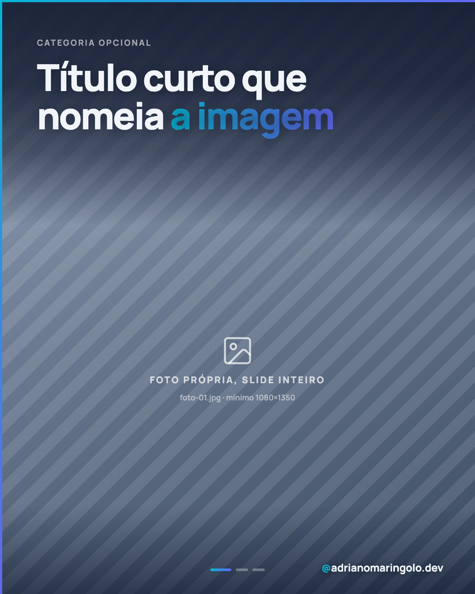
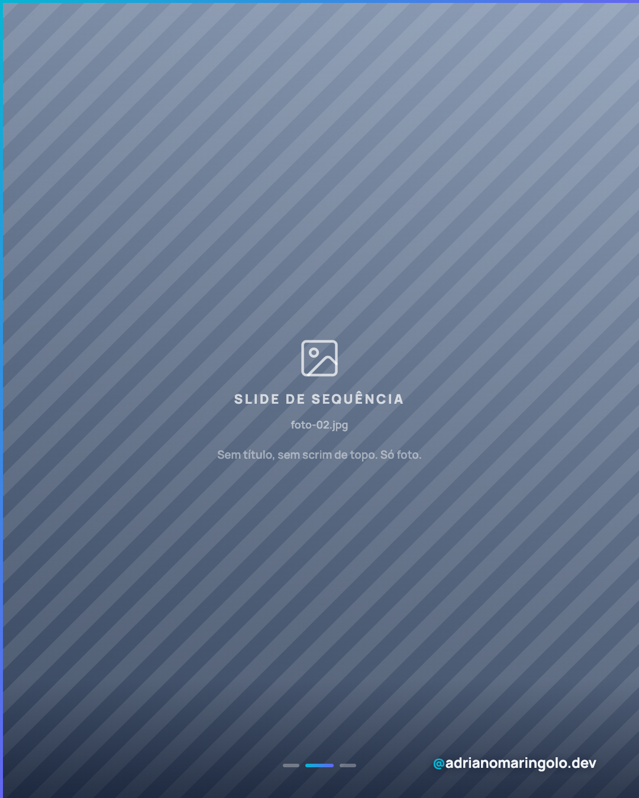
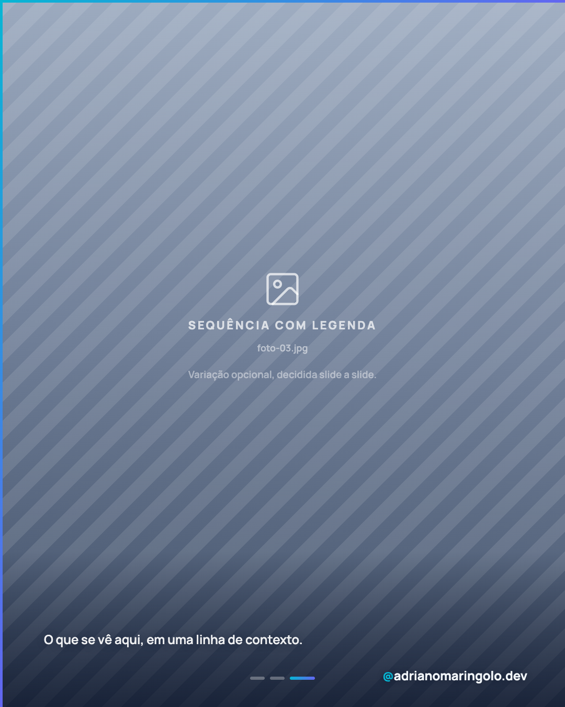

# Template `foto-protagonista`

A imagem é o conteúdo. Um scrim escuro nasce no topo, segura um título curto, e some — o
resto do slide é foto limpa. É o único template do projeto em que o texto serve a imagem, e
não o contrário.

---

## Preview

<table>
<tr><td width="32%"></td><td width="32%"></td><td width="32%"></td></tr>
<tr><td align="center"><b>Abertura</b><br><sub>scrim de topo + título</sub></td><td align="center"><b>Sequência</b><br><sub>foto limpa, sem texto</sub></td><td align="center"><b>Sequência + legenda</b><br><sub>variação opcional</sub></td></tr>
</table>

Conteúdo placeholder. O HTML que gera estas imagens está em `previews/foto-protagonista/` — edite e rode
`node scripts/export-templates.mjs foto-protagonista` para regerar.

---

## Quando usar

- **Bastidor e rotina** (pilar 5): mesa de trabalho, dia a dia, viagem, evento.
- **Retrato e presença** (pilar 5/3): você aparecendo, foto profissional, apresentação.
- **Projeto no mundo real** (pilar 2): o site rodando no celular na mão de alguém, o
  ambiente do negócio atendido, o produto do cliente.
- **Frase sobre imagem** (pilar 1/5): uma ideia curta ancorada numa imagem forte.

**Não use quando:**

- O post precisa de mais de um título. Subtítulo, bullet ou card aqui é sinal de que o
  template certo é `foto-editorial` — lá a foto dá contexto e o texto desenvolve.
- A foto seria de banco de imagem. Sem foto própria este formato não significa nada; use
  `tipografico`.
- A foto é só textura atrás de uma frase de impacto. Isso é `frase-unica` variante B, onde
  o véu cobre o slide inteiro.

---

## Estrutura de slides

### Post único
Um slide: foto + scrim de topo + título. Sem progress dots. O desenvolvimento vive na legenda.

### Carrossel — 3 a 7 fotos
| Slide | Papel | Texto |
|---|---|---|
| 01 | Abertura | Scrim de topo + título. É o único slide com título. |
| 02 a N | Sequência | Foto limpa. Legenda curta de contexto é opcional, slide a slide. |

**Não há slide de fecho.** A sequência termina em foto e o CTA vive na legenda do post —
um slide escuro de link no fim quebraria o ritmo visual que é o ponto do template.

---

## Capa

```html
<div class="slide">
  <div class="bg-photo"></div>
  <div class="scrim-top"></div>
  <div class="scrim-foot"></div>
  <div class="accent-left"></div>
  <div class="accent-top"></div>

  <div class="content">
    <div class="eyebrow">Categoria</div>
    <h1 class="title">Título curto que<br>nomeia <em>a imagem</em></h1>
  </div>

  <div class="progress"><!-- dots, só em carrossel --></div>
  <div class="handle"><em>@</em>adrianomaringolo.dev</div>
</div>
```

```css
body { width: 1080px; height: 1350px; overflow: hidden;
       background: #0a1226; font-family: 'Manrope', sans-serif; }

.bg-photo { position: absolute; inset: 0;
  background: url('foto-01.jpg') center center / cover no-repeat; }

/* scrim de topo — segura o título, some antes do meio */
.scrim-top { position: absolute; top: 0; left: 0; right: 0; height: 38%;
  background: linear-gradient(to bottom,
    rgba(10,18,38,0.88)  0%,
    rgba(10,18,38,0.78) 38%,
    rgba(10,18,38,0.52) 68%,
    rgba(10,18,38,0.00) 100%); }

/* véu de rodapé — só para a assinatura ficar legível sobre qualquer foto */
.scrim-foot { position: absolute; bottom: 0; left: 0; right: 0; height: 15%;
  background: linear-gradient(to top,
    rgba(10,18,38,0.55) 0%,
    rgba(10,18,38,0.28) 45%,
    rgba(10,18,38,0.00) 100%); }

.content { position: absolute; top: 0; left: 0; right: 0; z-index: 10;
  padding: 84px 84px 0; }

.eyebrow { font-size: 19px; font-weight: 700; letter-spacing: 0.16em;
  text-transform: uppercase; color: rgba(255,255,255,0.58); margin-bottom: 22px; }

.title { font-size: 84px; font-weight: 900; line-height: 1.03;
  letter-spacing: -0.035em; color: #f1f5f9;
  text-shadow: 0 2px 28px rgba(10,18,38,0.45); }

.title em { font-style: normal;
  background: linear-gradient(90deg, #06b6d4, #6366f1);
  -webkit-background-clip: text; -webkit-text-fill-color: transparent;
  background-clip: text; }
```

### A palavra em gradiente

O `<em>` com gradiente é permitido, mas **só onde o scrim ainda está opaco** — na prática,
nos primeiros ~45% da altura do scrim, onde a opacidade é `≥ 0.70`. Com `scrim-top: 38%`
isso vai até cerca de `y: 230px`, o que cobre as duas linhas do título em 84px.

Fora dessa faixa o gradiente perde contraste e a palavra some em foto clara. Se o título
descer (título de 3 linhas, scrim mais curto, eyebrow alto), confira onde a palavra caiu e
deixe branco sólido se ela saiu da faixa opaca.

---

## Slides internos

Slides 2 a N do carrossel: **foto limpa**, sem scrim de topo. Só `accent-left`,
`accent-top`, `scrim-foot`, progress dots e handle.

Legenda curta de contexto é **opcional e decidida slide a slide** — um slide pode ter,
o seguinte não:

```html
<div class="caption">O que se vê aqui, em uma linha.</div>
```

```css
.caption { position: absolute; left: 84px; right: 200px; bottom: 112px; z-index: 15;
  font-size: 24px; font-weight: 600; color: rgba(255,255,255,0.92);
  line-height: 1.4; text-shadow: 0 2px 20px rgba(10,18,38,0.6); }
```

Quando houver legenda, o `.scrim-foot` sobe para `height: 22%` **e fecha mais forte na
base** — foto clara come o texto branco mesmo com `text-shadow`:

```css
.scrim-foot { height: 22%;
  background: linear-gradient(to top,
    rgba(10,18,38,0.72) 0%,
    rgba(10,18,38,0.40) 48%,
    rgba(10,18,38,0.00) 100%); }
```

---

## Fecho

Não existe. A última foto é o último slide.

O CTA vive na legenda do post (`link na bio`, `me chama`, `comenta aí`). Se o post tem
intenção comercial forte e você sente falta de um fecho, o template errado foi escolhido:
`foto-editorial` e `case-showcase` terminam em CTA por construção.

---

## Imagens

- **Só foto própria.** Sem foto sua, não use este template. É a trava que faz o formato
  significar alguma coisa — foto de banco aqui vira post genérico com título por cima.
- Nomes na pasta do post: `foto-01.jpg`, `foto-02.jpg`, … na ordem dos slides.
- Path **relativo**: `url('foto-01.jpg')`.
- Mínimo 1080×1350. Ideal 1620×2025 — a foto ocupa o slide inteiro, pixel ruim aparece.
- A foto da capa precisa de **área respirável no terço superior**: é onde o título mora.
  Rosto ou assunto encostado no topo briga com o texto.
- Foto muito clara no topo exige subir a opacidade inicial do scrim (até `0.94`) em vez de
  clarear o título.
- Ponto focal livre via `background-position` — enquadre pelo assunto, não pelo centro
  geométrico.

---

## Escala tipográfica

| Elemento | Tamanho | Peso | Cor |
|---|---|---|---|
| `eyebrow` | 19px | 700 | `rgba(255,255,255,0.58)`, uppercase, `letter-spacing: 0.16em` |
| `title` | 72–92px | 900 | `#f1f5f9`, `letter-spacing: -0.035em`, máx. 2 linhas |
| `caption` (opcional) | 22–26px | 600 | `rgba(255,255,255,0.92)` |
| `handle` | 24px | 700 | `#f1f5f9` |

O título é **menor** que o do `frase-unica` (96–116px) de propósito: lá o texto é o
assunto e precisa ocupar o slide; aqui ele é rótulo e precisa caber sem tapar a foto.

---

## Variações permitidas

- Título entre 72px e 92px conforme o número de palavras.
- `eyebrow` entra ou não.
- Uma palavra do título em gradiente cyan→indigo, respeitando a regra da faixa opaca.
- Altura do `scrim-top` entre 30% e 42%, conforme onde a foto tem área limpa.
- Post único ou carrossel de 3 a 7 fotos.
- Legenda de contexto em qualquer slide de sequência — por slide, não é tudo ou nada.
- Ponto focal de cada foto livre (`background-position`).
- Quebra de linha do título manual (`<br>`), para equilibrar as duas linhas.

## Travas

- **Um título, e só.** Sem subtítulo, sem bullet, sem card, sem número. Se o post precisa
  desenvolver, o template é `foto-editorial` — o que define este aqui é a imagem mandar.
- **Foto própria, sempre.** Banco de imagem transforma o formato em post genérico com
  título; sem a foto ser sua, o post não prova nada.
- **Véu só nas bordas, miolo limpo.** Scrim de topo (30–42%) e véu de rodapé discreto
  (≤22%). Véu de corpo inteiro é `frase-unica` variante B — é exatamente a fronteira
  entre os dois templates.
- **Máximo 9 palavras e 2 linhas no título.** É rótulo, não manchete: se não couber,
  corte a ideia.
- **Sem slide de CTA.** Fecho escuro com link quebra o ritmo de fotos que é o ponto do
  template. O CTA vive na legenda.
- **Gradiente só onde o scrim está em `≥ 0.70`.** Sobre foto limpa ele perde contraste e
  some em imagem clara. Se a palavra saiu dessa faixa, ela vira branco sólido.
- Herdadas da marca: `accent-left` + `accent-top` em todos os slides, handle sempre
  presente, progress dots com a contagem certa no carrossel (e **ausentes** no post único),
  `background` declarado no `body`, nenhum emoji no slide.

---

## Posts de referência

Nenhum ainda — este template é território novo no feed. Os quatro posts com foto do
arquivo (`post-02`, `post-15`, `post-17`, `post-19`) usam a foto como textura sob texto,
que é justamente o oposto daqui.

O preview é a referência até o primeiro post sair. Quando sair, anote-o nesta seção.
