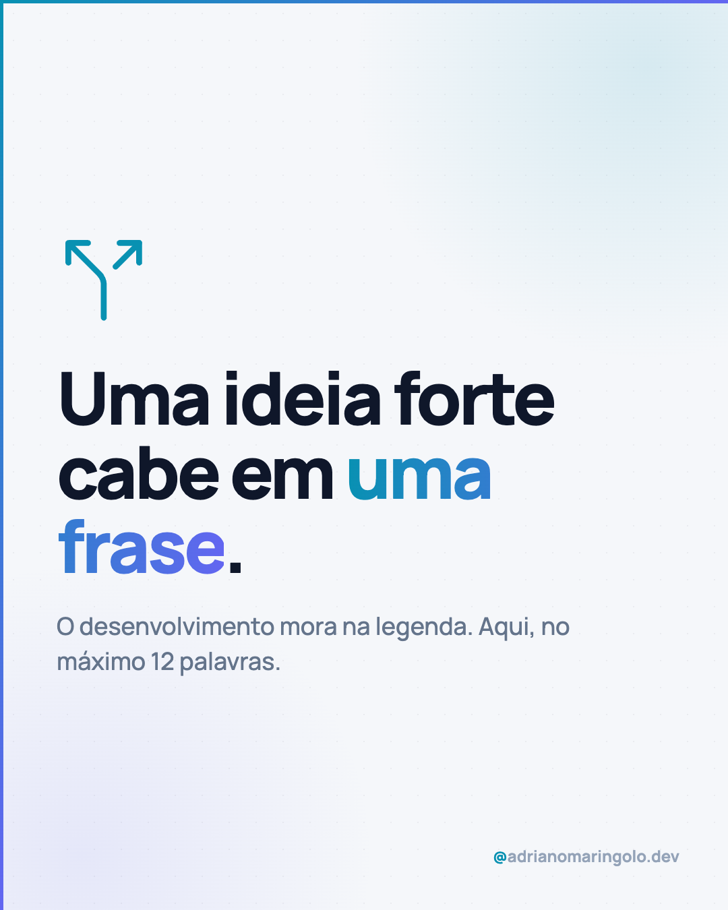
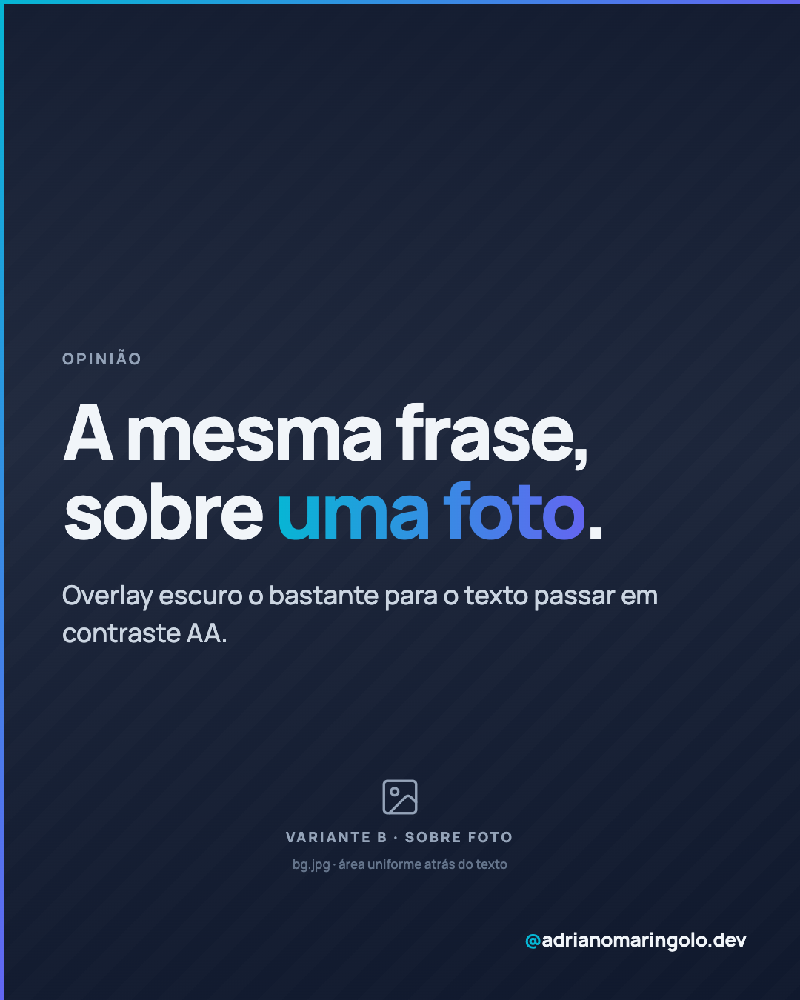

# Template `frase-unica`

Um slide. Uma ideia. É o post mais barato de produzir e o que mais reforça posicionamento —
o "ritmo" entre carrosséis.

---

## Preview

<table>
<tr><td width="49%"></td><td width="49%"></td></tr>
<tr><td align="center"><b>Variante A</b><br><sub>tipográfica, tema claro</sub></td><td align="center"><b>Variante B</b><br><sub>sobre foto, tema escuro</sub></td></tr>
</table>

Conteúdo placeholder. O HTML que gera estas imagens está em `previews/frase-unica/` — edite e rode
`node scripts/export-templates.mjs frase-unica` para regerar.

---

## Quando usar

- Uma provocação, princípio de marca ou opinião que cabe numa frase.
- Semana cheia e você precisa manter constância sem produzir carrossel.
- Pilar 5 (humano e opinião) e pilar 1 (educação, em dose curta).

---

## Estrutura de slides

**Um slide só.** `"type": "single"` no `meta.json`, formato `1080x1350`.

Sem progress dots — não é carrossel. O handle continua obrigatório.

O desenvolvimento da ideia mora na **legenda**, não em slides extras. Se a ideia precisa de
três slides, ela não é um `frase-unica` — é um `tipografico`.

---

## Capa (o slide)

Duas variantes, ambas válidas:

### Variante A — tipográfica (padrão)

Fundo claro `#f5f7fa` ou escuro `#0f172a`, headline ocupando o centro óptico, subtítulo
curto abaixo, assinatura no rodapé.

```html
<div class="slide">
  <div class="blob-1"></div><div class="blob-2"></div><div class="bg-dots"></div>
  <div class="accent-left"></div><div class="accent-top"></div>

  <div class="content">
    <div class="eyebrow">Opinião</div>
    <h1 class="headline">Sênior não é quem<br><em>nunca erra</em>.</h1>
    <p class="subtitle">É quem sabe o custo do erro antes de cometê-lo.</p>
  </div>

  <div class="handle"><em>@</em>adrianomaringolo.dev</div>
</div>
```

```css
.content { position: absolute; inset: 0; z-index: 10;
  padding: 120px 84px; display: flex; flex-direction: column; justify-content: center; }
.headline { font-size: 104px; font-weight: 900; line-height: 1.02;
            letter-spacing: -0.04em; color: #0f172a; }
.headline em { font-style: normal; background: linear-gradient(90deg, #0891b2, #6366f1);
            -webkit-background-clip: text; -webkit-text-fill-color: transparent;
            background-clip: text; }
.subtitle { margin-top: 36px; font-size: 36px; font-weight: 500;
            color: #64748b; line-height: 1.45; max-width: 860px; }
```

### Variante B — sobre foto

Foto de fundo (`bg.jpg`) com overlay escuro forte e headline por cima. Mesma mecânica de
overlay do template `foto-editorial`, mas o texto pode ocupar o centro ou a base, já que
não existe slide seguinte disputando composição.

```css
body { background: #0a1226; }
.bg-photo { position: absolute; inset: 0; background: url('bg.jpg') center center / cover no-repeat; }
.gradient-overlay { position: absolute; inset: 0;
  background: linear-gradient(to bottom,
    rgba(10,18,38,0.92) 0%, rgba(10,18,38,0.80) 45%, rgba(10,18,38,0.88) 100%); }
```

---

## Slides internos

Não existem. Se você sentiu falta, troque de template.

---

## Fecho

Não existe slide de CTA. O CTA vive na legenda (`link na bio`, `me segue`, `comenta aí`).

A assinatura visual é o handle no rodapé — ele faz o papel de fecho.

---

## Imagens

- Variante A: nenhuma.
- Variante B: `bg.jpg` na pasta do post, path relativo, mínimo 1080×1350.
- A foto precisa ter área uniforme onde o texto vai cair. Foto com muito detalhe atrás da
  headline mata a leitura mesmo com overlay.

---

## Escala tipográfica

| Elemento | Tamanho | Peso | Cor |
|---|---|---|---|
| `eyebrow` | 19–22px | 700 | `#94a3b8` (claro) / `#64748b` (escuro), uppercase |
| `headline` | 96–116px | 900 | `#0f172a` (claro) / `#f1f5f9` (escuro) |
| `subtitle` | 32–38px | 500 | `#64748b` (claro) / `#cbd5e1` (escuro) |
| `handle` | 22–27px | 700 | `#94a3b8` / `#f1f5f9` |

O headline é grande **de propósito**: este post é lido em 1,5 segundo no feed.

---

## Variações permitidas

- Tema claro ou escuro, variante tipográfica ou fotográfica.
- Headline de 96px a 116px conforme o número de palavras.
- `eyebrow` opcional.
- `subtitle` opcional — às vezes a frase sozinha é mais forte.
- Um ícone Lucide grande (120–160px, `stroke-width: 1.5`, cor `#0891b2`) pode substituir o
  `eyebrow` como ancoragem visual.
- Alinhamento do bloco de texto: centro vertical (padrão) ou base.

## Travas

- **Um slide.** `"type": "single"`.
- **Sem progress dots.**
- Máximo de 12 palavras no headline. Se não couber, corte a ideia, não a fonte.
- Handle sempre presente.
- `accent-left` + `accent-top` sempre.
- Sem emoji no slide — emoji é só na legenda.
- Slide escuro: `background` declarado no `body`.

---

## Posts de referência

`post-02` (sênior não é quem nunca erra) · `post-17` (presença digital não é só Instagram) ·
`post-11` (ser educado com o ChatGPT) — este último no cruzamento com `dado-visual`.
