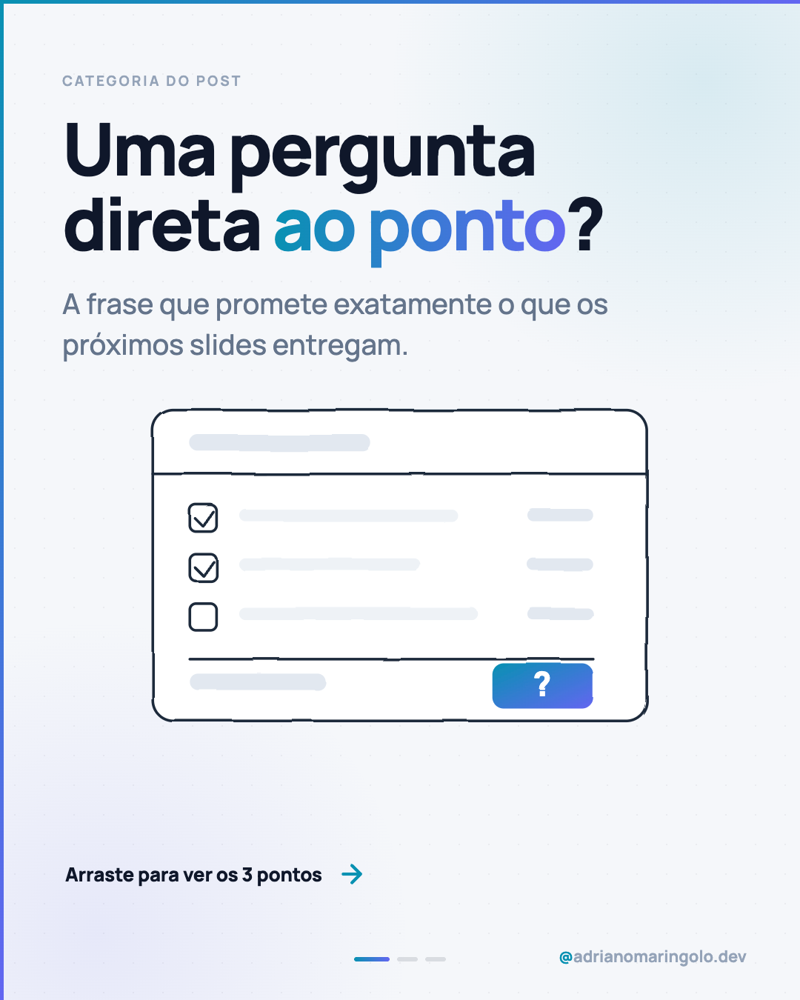
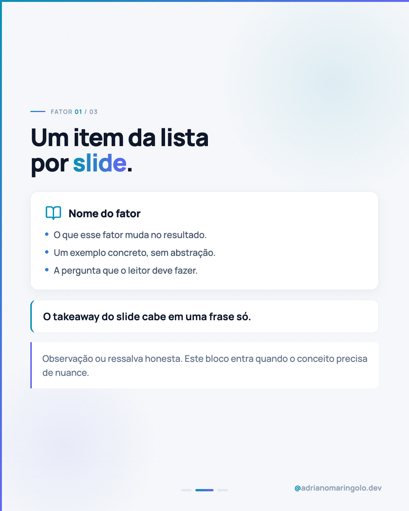

# Template `tipografico`

Capa **clara**, sem foto: a headline gigante é a imagem. Opcionalmente acompanhada de uma
ilustração SVG em traço com filtro de "rabisco". É o template mais versátil e o que menos
depende de material externo.

---

## Preview

<table>
<tr><td width="32%"></td><td width="32%"></td><td width="32%"></td></tr>
<tr><td align="center"><b>Capa</b><br><sub>clara, headline + ilustração rabiscada</sub></td><td align="center"><b>Interno</b><br><sub>counter + card</sub></td><td align="center"><b>Fecho</b><br><sub>CTA escuro</sub></td></tr>
</table>

Conteúdo placeholder. O HTML que gera estas imagens está em `previews/tipografico/` — edite e rode
`node scripts/export-templates.mjs tipografico` para regerar.

---

## Quando usar

- Conceito, lista numerada, comparativo, pergunta direta ("Quanto custa um site?").
- Não existe foto que acrescente — ou a foto disponível seria decorativa.
- Pilares 1 (educação para o cliente) e 4 (autoridade técnica).

---

## Estrutura de slides

| Slide | Papel | Tema |
|---|---|---|
| 01 | Capa tipográfica + ilustração | **Claro** `#f5f7fa` |
| 02 | Contexto / por que isso importa | Claro |
| 03 a N-1 | Um item por slide (com `counter` se for lista) | Claro |
| N | CTA | Escuro `#0f172a` |

Faixa: **5 a 9 slides**.

> Este é o único template cuja capa é clara. É proposital: cria contraste no feed ao lado
> dos posts de capa escura e sinaliza "conteúdo de leitura".

---

## Capa

```html
<div class="slide">
  <div class="bg-dots"></div>
  <div class="blob-1"></div>
  <div class="blob-2"></div>
  <div class="accent-left"></div>
  <div class="accent-top"></div>

  <div class="content">
    <div class="eyebrow">Categoria</div>
    <h1 class="headline">Pergunta ou<br>afirmação <em>forte</em></h1>
    <p class="subtitle">Uma frase que promete o que o carrossel entrega.</p>
    <div class="art"><!-- SVG opcional --></div>
  </div>

  <div class="footer-row">
    <div class="swipe">Arraste para ver os 5 fatores</div>
    <div class="arrow"><!-- Lucide arrow-right --></div>
  </div>

  <div class="progress"><!-- dots --></div>
  <div class="handle"><em>@</em>adrianomaringolo.dev</div>
</div>
```

```css
body { width: 1080px; height: 1350px; overflow: hidden;
       background: #f5f7fa; font-family: 'Manrope', sans-serif; }

.blob-1 { position: absolute; width: 860px; height: 860px; top: -320px; right: -300px;
  background: radial-gradient(circle, rgba(8,145,178,0.12) 0%, transparent 70%); }
.blob-2 { position: absolute; width: 860px; height: 860px; bottom: -340px; left: -300px;
  background: radial-gradient(circle, rgba(99,102,241,0.10) 0%, transparent 70%); }

.content { position: absolute; inset: 0; z-index: 10;
  padding: 96px 84px 0 84px; display: flex; flex-direction: column; }

.eyebrow  { font-size: 19px; font-weight: 700; letter-spacing: 0.16em;
            text-transform: uppercase; color: #94a3b8; margin-bottom: 28px; }
.headline { font-size: 98px; font-weight: 900; line-height: 1.03;
            letter-spacing: -0.038em; color: #0f172a; }
.headline em { font-style: normal; background: linear-gradient(90deg, #0891b2, #6366f1);
            -webkit-background-clip: text; -webkit-text-fill-color: transparent;
            background-clip: text; }
.subtitle { margin-top: 30px; font-size: 39px; font-weight: 500;
            color: #64748b; line-height: 1.46; max-width: 900px; }

.footer-row { position: absolute; bottom: 150px; left: 88px; right: 88px;
  display: flex; align-items: center; gap: 20px; z-index: 15; }
.swipe { font-size: 26px; font-weight: 800; color: #0f172a; letter-spacing: -0.01em; }
.arrow { color: #0891b2; display: flex; }
```

### Ilustração SVG "rabiscada" (opcional, mas é a assinatura deste template)

Desenho em traço `#1e293b` sobre formas `#ffffff`/`#e2e8f0`, com filtro de deslocamento que
dá aparência de desenho à mão:

```html
<defs>
  <linearGradient id="g" x1="0" y1="0" x2="1" y2="1">
    <stop offset="0" stop-color="#0891b2"/><stop offset="1" stop-color="#6366f1"/>
  </linearGradient>
  <filter id="sk" x="-8%" y="-8%" width="116%" height="116%">
    <feTurbulence type="fractalNoise" baseFrequency="0.013" numOctaves="2" seed="9" result="n"/>
    <feDisplacementMap in="SourceGraphic" in2="n" scale="3.4"/>
  </filter>
</defs>

<g filter="url(#sk)" fill="none" stroke="#1e293b" stroke-width="2.6"
   stroke-linecap="round" stroke-linejoin="round">
  <!-- formas -->
</g>
```

O elemento em destaque (o "ponto" da ilustração) recebe `fill="url(#g)"` — é a única coisa
colorida do desenho.

---

## Slides internos

Base clara padrão. Para listas, use `counter` no topo de cada slide:

```html
<div class="counter">
  <div class="counter-line"></div>
  <span class="counter-text">FATOR <span class="counter-num">01</span> / 05</span>
</div>
```

Alterne entre `card`, `highlight`, `note` e `conclusion` para que os slides não fiquem
visualmente idênticos — mas **um tipo de componente dominante por slide**.

---

## Fecho

CTA escuro padrão `#0f172a`.

Variante: penúltimo slide pode ser um "resumo" com `conclusion` recapitulando os itens
antes do CTA — útil em listas de 5+ itens.

---

## Imagens

Nenhuma imagem raster. Tudo é SVG inline ou CSS.

Se um ícone for necessário: **Lucide**, path copiado da biblioteca, nunca desenhado de
memória. Mesmo `stroke-width` em todos os ícones do post.

---

## Escala tipográfica

| Elemento | Tamanho | Peso | Cor |
|---|---|---|---|
| `eyebrow` | 19px | 700 | `#94a3b8`, uppercase, `letter-spacing: 0.16em` |
| `headline` (capa) | 88–98px | 900 | `#0f172a`, `letter-spacing: -0.038em` |
| `subtitle` (capa) | 36–39px | 500 | `#64748b` |
| `swipe` | 26px | 800 | `#0f172a` |
| `headline` (interno) | 60–68px | 900 | `#0f172a` |
| Corpo | 26–32px | 500 | `#475569` |

---

## Variações permitidas

- Com ou sem ilustração SVG na capa (sem ilustração, a headline sobe para 102–110px).
- `footer-row` com "Arraste..." pode virar só a seta quando a capa já está cheia.
- Quebra de linha do headline é manual (`<br>`) — ajuste para equilibrar as linhas.
- Posição e tamanho dos blobs livres, desde que continuem sutis.
- A lista pode usar `counter`, ou numeração embutida no headline do slide.
- Penúltimo slide de resumo é opcional.

## Travas

- Capa **clara**. Nunca transforme este template em capa escura — para isso existe outro.
- Gradiente `#0891b2 → #6366f1` só no `<em>` do headline e no elemento de destaque do SVG.
  O resto do desenho é traço neutro.
- Fecho **sempre** escuro.
- `accent-left` + `accent-top`, progress dots e handle em todos os slides.
- Sem emoji nos slides.

---

## Posts de referência

`post-13` (quanto custa um site) · `post-14` (seu site é uma casa) ·
`post-10` (que tipo de site seu negócio precisa) · `post-09` (ninguém usa IA direito) ·
`post-01` (quem sou eu).
